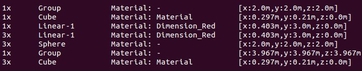
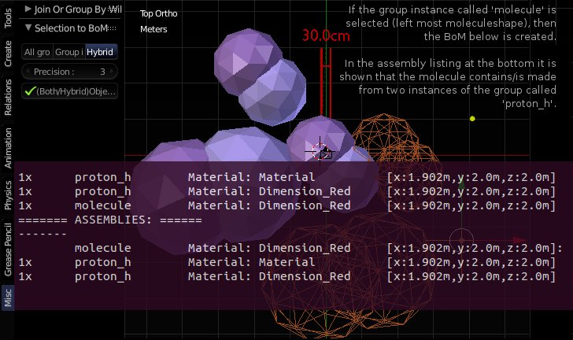

Selection to Bill of Materials [[FAQ](frequently_asked_questions.md)]
====

http://blenderartists.org/forum/showthread.php?317584-Ext-Selection-2-Bill-of-Materials-%28supporting-recursive-group-instances%29&p=2514432&viewfull=1#post2514432

Low level Parts only (resolve group instances to the contained objects)
----

Hybrid Mode
----

